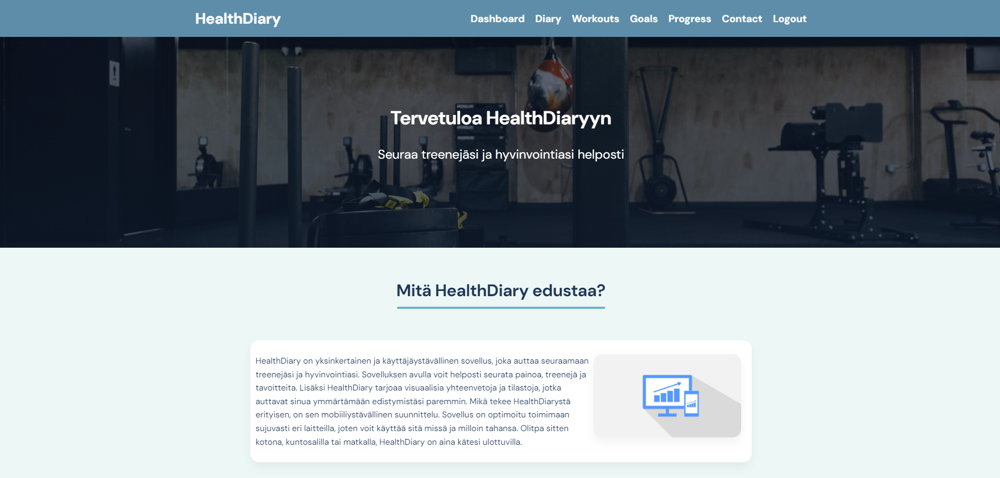
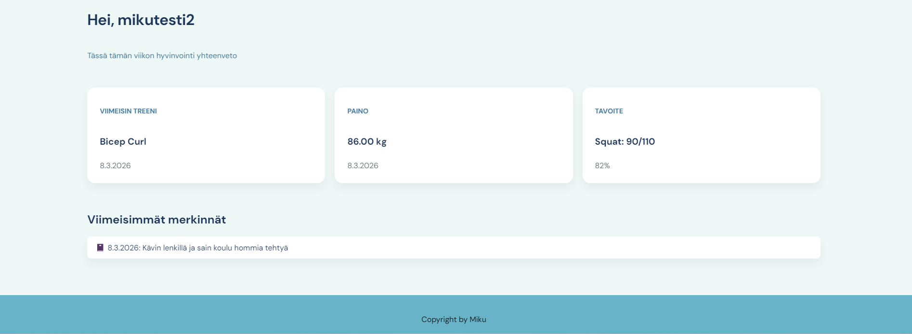
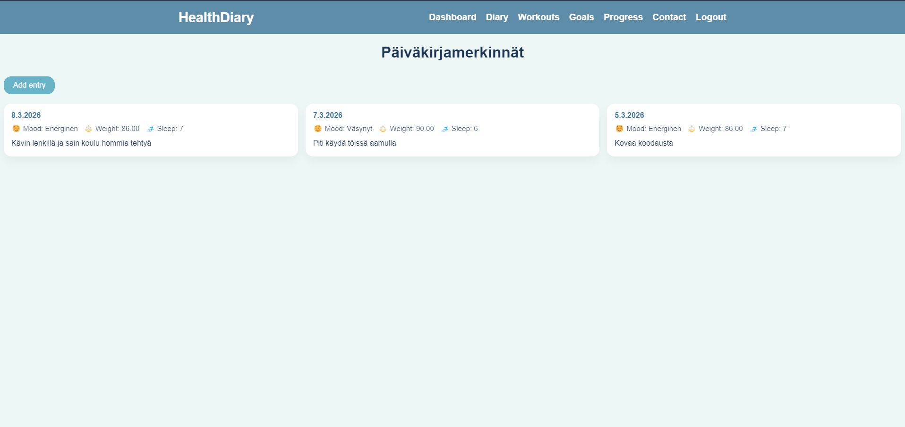
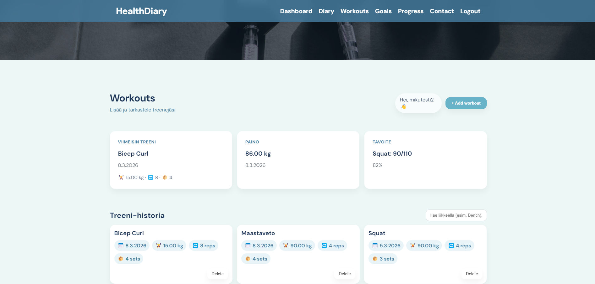
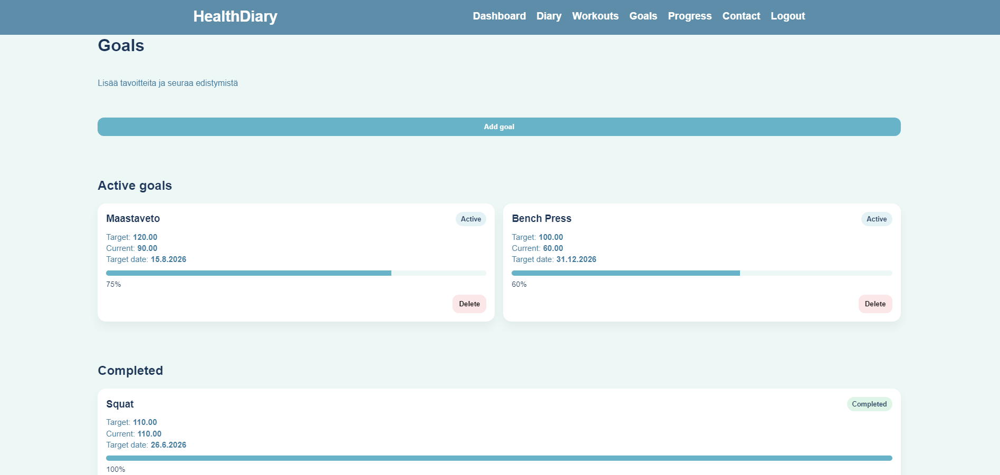
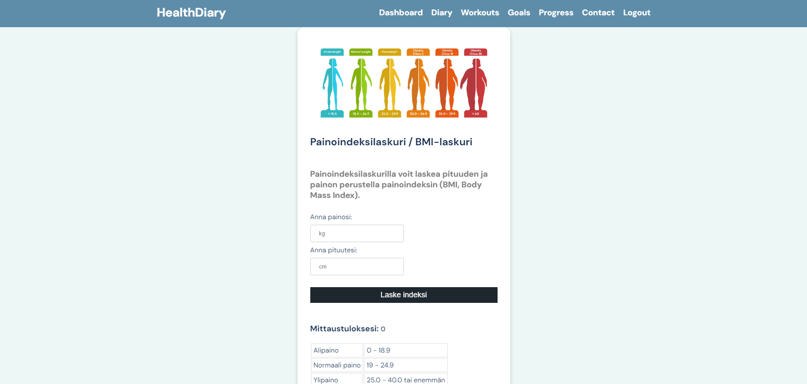
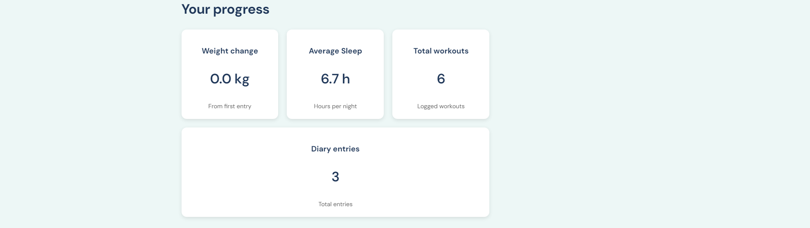
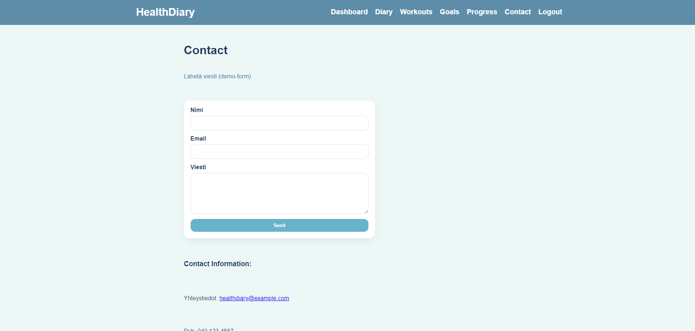

# HealthDiary

HealthDiary on web-sovellus, jolla käyttäjä voi seurata omaa hyvinvointiaan.  
Sovelluksessa voi tallentaa päiväkirjamerkintöjä, treenejä, tavoitteita sekä tarkastella omaa kehitystä.

Sovellus on rakennettu full stack -arkkitehtuurilla:

Frontend:

- HTML
- CSS
- JavaScript

Backend:

- Node.js
- Express
- MySQL

Autentikointi:

- JWT (JSON Web Token)

---

# Sovelluksen käyttöliittymä

## Dashboard

Dashboard näyttää käyttäjän tärkeimmät tiedot yhdellä sivulla:

- viimeisin treeni
- viimeisin paino
- aktiivinen tavoite
- viimeisin päiväkirjamerkintä

---

## Diary entries

Diary-sivulla käyttäjä voi lisätä ja tarkastella hyvinvointimerkintöjä.

Tallennettavia tietoja:

- päivämäärä
- mood
- paino
- unen määrä
- muistiinpanot

---

## Workouts

Workouts-sivulla käyttäjä voi tallentaa treenejä.

Tallennettavat tiedot:

- liike
- paino
- toistot
- sarjat
- päivämäärä

---

## Goals

Goals-sivulla käyttäjä voi lisätä tavoitteita.

Esimerkkejä:

- maastaveto 100kg
- penkkipunnerrus 80kg

Sivu näyttää:

- tavoitteen
- nykyisen progressin
- completion-prosentin

---

## Progress

Progress-sivulla näytetään käyttäjän hyvinvoinnin tilastoja:

- keskimääräinen unen määrä
- painon muutos
- treenien määrä

Lisäksi sivulla on BMI-laskuri.

---

## Contact

Contact-sivulla käyttäjä voi lähettää palautetta sovelluksesta.

---

# Tietokantarakenne

Sovellus käyttää MySQL-tietokantaa.

## Users

| field         | type    |
| ------------- | ------- |
| user_id       | int     |
| username      | varchar |
| email         | varchar |
| password      | varchar |
| user_level_id | int     |

---

## DiaryEntries

| field       | type    |
| ----------- | ------- |
| entry_id    | int     |
| user_id     | int     |
| entry_date  | date    |
| mood        | varchar |
| weight      | decimal |
| sleep_hours | decimal |
| notes       | text    |

---

## Workouts

| field        | type    |
| ------------ | ------- |
| workout_id   | int     |
| user_id      | int     |
| exercise     | varchar |
| weight_kg    | decimal |
| reps         | int     |
| sets         | int     |
| workout_date | date    |

---

## Goals

| field         | type    |
| ------------- | ------- |
| goal_id       | int     |
| user_id       | int     |
| goal_type     | varchar |
| target_value  | decimal |
| current_value | decimal |
| target_date   | date    |
| status        | varchar |

---

# Toteutetut toiminnallisuudet

### Autentikointi

- käyttäjän rekisteröinti
- käyttäjän kirjautuminen
- JWT token autentikointi
- suojatut API-reitit

### Diary entries

- uusi päiväkirjamerkintä
- merkintöjen listaus
- merkintöjen poistaminen
- merkinnät käyttäjäkohtaisesti

### Workouts

- treenin lisääminen
- treenien listaus
- treenien poistaminen
- käyttäjäkohtaiset treenit

### Goals

- tavoitteiden lisääminen
- tavoitteiden listaus
- tavoitteiden poistaminen
- progressin laskeminen

### Dashboard

Dashboard näyttää:

- viimeisin treeni
- viimeisin paino
- aktiivinen tavoite
- viimeisin päiväkirjamerkintä

### Progress

- keskimääräinen unen määrä
- painon muutos
- treenien määrä
- BMI-laskuri

---

# Tiedossa olevat bugit / ongelmat

- Dashboard hakee diary entries kahdesti (ei vaikuta toimintaan)
- BMI-laskuri ei tallenna tuloksia tietokantaan

---

# Käytetyt teknologiat

Frontend

- HTML
- CSS
- JavaScript
- Fetch API

Backend

- Node.js
- Express
- MySQL
- bcryptjs
- jsonwebtoken
- express-validator

---

# Referenssit

Kurssimateriaalit

MDN Web Docs  
https://developer.mozilla.org

JWT documentation  
https://jwt.io

Express documentation  
https://expressjs.com

MySQL documentation  
https://dev.mysql.com/doc/

Stack Overflow
